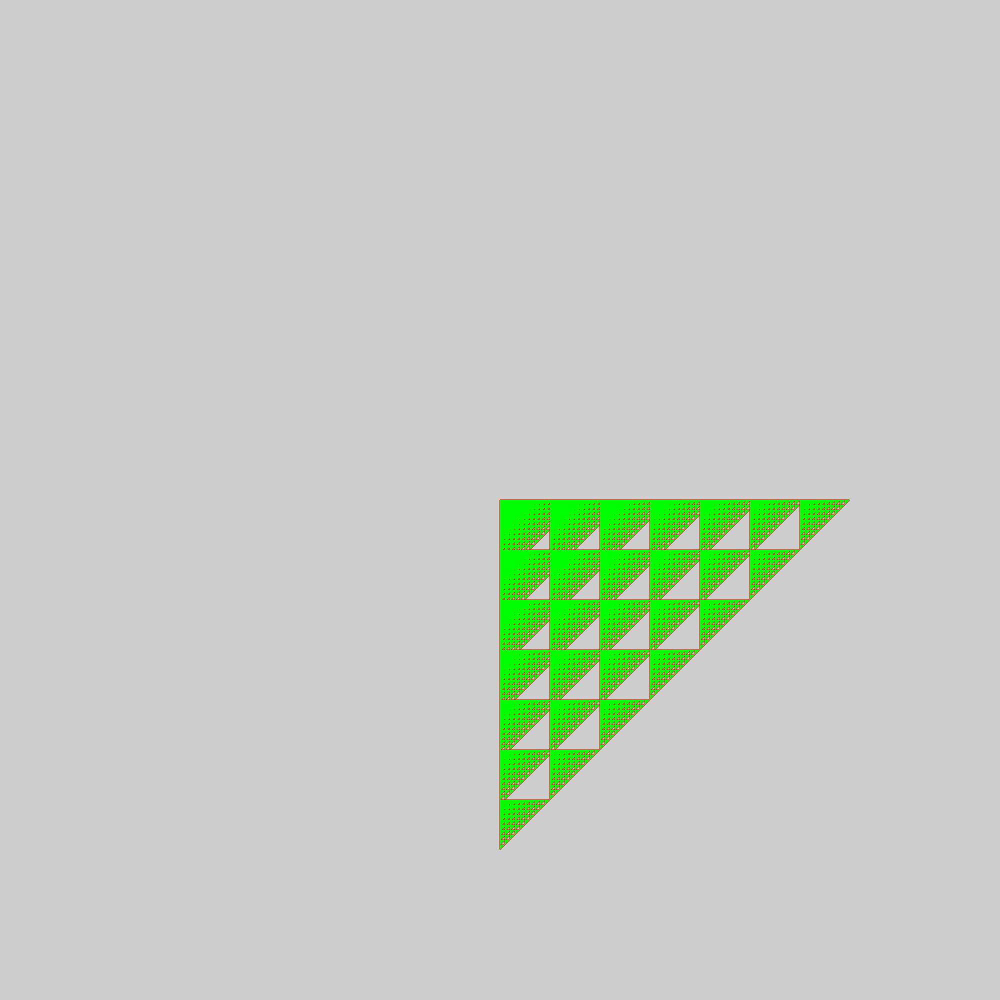
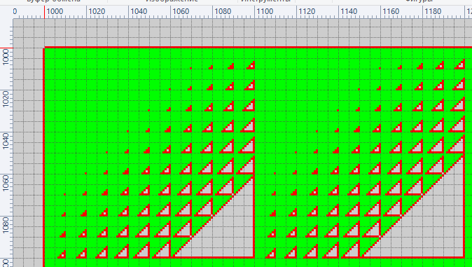

# ant_on_grid  

Вариант для Python + JavaScript + Html можно найти   
https://github.com/Boring-Mind/Ant-assignment  

# Задача  
На бесконечной координатной сетке находится муравей.
Муравей может перемещаться на 1 клетку вверх (x,y+1), вниз (x,y-1), влево (x-1,y), вправо (x+1,y), по одной клетке за шаг.

Клетки, в которых сумма цифр в координате X плюс сумма цифр в координате Y больше, чем 25 недоступны муравью.
Например, клетка с координатами (59, 79) недоступна, т.к. 5+9+7+9=30, что больше 25.

Сколько клеток может посетить муравей если его начальная позиция (1000,1000), (включая начальную клетку).
Прислать ответ в виде числа клеток и решение на языке C++

# Результат  

```
19:32:16: Starting I:\proj\build-ant_on_grid-Desktop_Qt_6_6_0_MSVC2019_64bit-Release\ant_on_grid.exe...
Max point count: 148848
19:32:16: I:\proj\build-ant_on_grid-Desktop_Qt_6_6_0_MSVC2019_64bit-Release\ant_on_grid.exe exited with code 0
```




